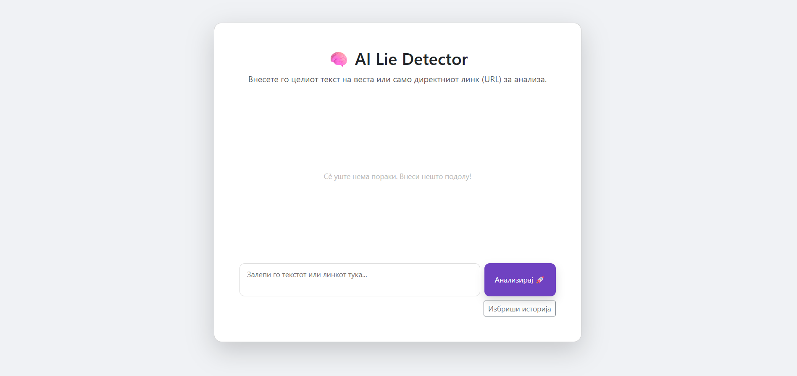
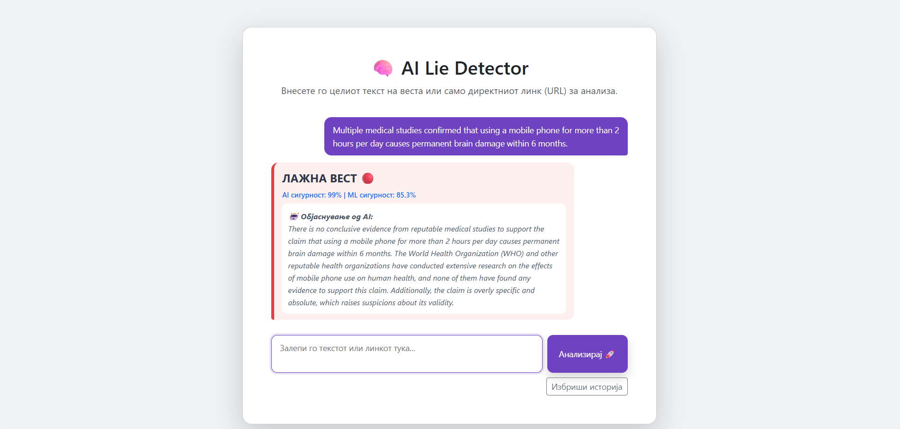

# AI LIE DETECTOR

## 1. Учесници

Индивидуален проект.

## 2. Наслов на проектот

**AI Lie Detector**

## 3. Тип на проект

Машинско учење (класификација на текст) со користење на AI API.

## 4. Опис на проектот

Овој проект има за цел да се изгради апликација која автоматски препознава дали дадена вест е вистинита или лажна. Корисникот внесува текст од вест или линк, а системот ја анализира содржината. Проектот е наменет за ученици, студенти и пошироката јавност кои сакаат да проверуваат информации. Лажните вести се голем проблем на социјалните мрежи и медиумите, па овој проект помага во развивање на критичко размислување. Апликацијата ќе дава јасен резултат со кратко објаснување зошто веста е означена како сомнителна.

## 5. AI API(и)

**ChatGPT API** – се користи за дополнителна анализа на текстот и објаснување на резултатот на разбирлив начин за корисникот.

## 6. Датасет

Проектот користи отворен датасет од Kaggle со наслов „Fake News Detection“.

* **Извор:** Kaggle (Open Datasets)
* **Големина и формат:** --
* **Користење:** Податоците ќе се користат за тренирање модел кој класифицира вести како вистинити или лажни.

## 7. Карактеристики на проектот

* Автоматска анализа и класификација на текст на вести.
* Приказ на резултат (вистинита / лажна / сомнителна).
* Кратко AI-објаснување зошто е добиен тој резултат.

## 8. Очекуван резултат

Конечниот резултат ќе биде веб апликација со едноставен интерфејс. Корисникот внесува текст од вест и добива јасен одговор со процент на сигурност и текстуално објаснување. Ќе биде прикажан пример на анализа на реална вест како демонстрација на проектот.


### Процес на работа

1. 22.04 Поврзување со Kaggle DataSet
2. 20.05 Fixing Dataset problem, training it. Fixing the problem with the API Key. Starting to make a interface for the Dataset.


# УПАТСТВО ЗА КОРИСТЕЊЕ НА ОВАА ВЕБ АПЛИКАЦИЈА

## Чекор 1.

Пред да започнеш со употреба на оваа апликација прво што треба да направиш е инсталирање на основните апликации кои што се потребни. (Python 3.10+, Ollama, Git...)

## Чекор 2.

Откако исталацијата на апликациите е готова преминуваме на клонирање на ова github repository со помош на Command Prompt или Git Bash.

## Чекор 3. 

Бидејќи не може да се споделува API key јавно и во ова GitHub repo нема file во кој што пишува API key, потребно е да направите .env file во документот ai-lie-detector кој што претходно го клониравте локално. Откако ќе го направите тој file, одете на browser, генерирајте API key и вметнете го во .env file-от во следниов формат: `GROQ_API_KEY="Вашиот API key"`

## Чекор 4.

Исто така, бидејќи dataset-от е преголем и не може да се стави на GitHub во фолдерот dataset отворете го .txt фајлот и копирајте го линкот. Откако ќе го копирате линкот преземете го dataset-от и ставете го во фолдерот во ai-lie-detector.

## Чекор 5.

Следно, го отварате проектот и во терминал ги пишувате следниве команди:
```bash
pip install flask requests beautifulsoup4 scikit-learn googlesearch-python
ollama pull llama3.1
ollama serve
python app.py
```
## Чекор 6. 

Откако ги завршивте претходните пет чекори, треба на browser да отворите http://127.0.0.1:5000 и да започнете со користење на веб апликацијата.

## ОБЈАСНУВАЊЕ ЗА ВЕБ АПЛИКАЦИЈАТА

Оваа веб апликација работи така што вие внесувате текст на полето за input и кликате анализирај. Текстот односно веста која што сте ја испратиле се анализира со помош на AI модел и за отприлика 10 секунди одговорот би требало да е готов. На крајот добиваш резултат, односно дали веста е вистинита или лажна и следува кратко објаснување за истото.

## Напомена

Бидејќи се користи постар AI модел се јавува knowledge cutoff и според тоа на некои информации одговорите можеби нема да се точни. На пример доколку имаме прашање околу политиката во Македонија одговорот на моделот ќе се базира на информации од пред неколку години и можеби нема одговорот да е точен. На пример како одговор на __"Hristijan Mickoski is the prime minister of North Macedonia"__ добиваме __"According to available information, Dimitar Kovačevski is the current Prime Minister of North Macedonia, not Hristijan Mickoski. Hristijan Mickoski is the leader of the opposition party VMRO-DPMNE"__, што ни покажува дека AI моделот користи застарени информации. 


## Изглед на апликацијата

### Почетна страна


### Резултат од анализа



